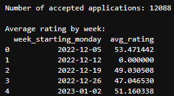

# Application Rating Analysis

This project processes loan application data to calculate a rating score for each application based on several criteria, then aggregates the results weekly.

## Dataset

- `applications.csv`: Contains loan application data with fields such as applicant ID, age, amount, external rating, education level, location, and more.
- `industries.csv`: Contains industries with associated scores.

## Tasks Implemented

The project includes loading and cleaning application data by removing duplicates and filling missing values, merging with industry scores, calculating a comprehensive rating for each application based on multiple criteria such as age, submission date, marital status, location, industry risk, and external ratings. Applications with missing critical information are scored zero and filtered out. Finally, accepted applications are grouped by week to analyze the average rating trend over time.

## Example Output



## Requirements

- Python 3.x
- pandas library

```bash
pip install pandas
